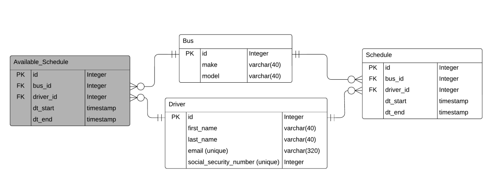

# SCHEDULE MANAGEMENT APP

## Summary
---
This solution attempts to solve the `advanced` challenge using a `flask` API and a `mysql` database.

The system can be run fully containerized using the `docker-compose` scripts or on a python venv using:
```shell
$ pip3 install virtualenv                           # installation
$ python3 -m virtualenv venv                        # init venv
$ source venv/bin/activate                          # activate
$ (venv) pip3 install --upgrade pip
$ (venv) pip3 install -r requirements.txt           # install requirements for venv
```
* User might need to specify python interpreter if the IDE has not selected the venv python interpreter automatically...
* default `{{socket}}/{{prefix}}` is `0.0.0.0:5000/api/v1`
* default database URI is `tester:password@0.0.0.0:3306/Schedules`
* API docs accessible at `./api_docs.yaml` or better, at `0.0.0.0:5000/apidocs` given that the app is running

## Docker compose solutions
---
| file | functionality |
| --- | --- |
| `docker-compose.db.yml` | for running a mysql contianer accessible by: `tester:password@0.0.0.0:3306/Schedules` |
| `volume/config/flask_test_docker.yaml` | for running mysql, API containers and giving the pytest results defined in `./tests/` |
| `docker-compose.yml` | for running mysql, API containers on the same docker bridge network where app accesses db by: `tester:password@mysql_db:3306/Schedules` |

## Running the APP
---
> using `docker-compose.yml`
```shell
$ docker-compose -f docker-compose.yml up [--build]
```
* The database is instantiated but not populated.
* Database can be populated using the following request which user may send using the `./tests.http` file or `swagger.io UI`
```text
POST http://{{socket}}/{{prefix}}/population
    ?buses=250
    &drivers=1000
    ?from=2022-01-01
    &to=2022-10-01
```
* The above request would insert ~1M schedules in the `Schedule` table, and ~100k in the `Available_Schedule` table. This operation would take about 2 minutes...
* User may retreive available schedules via:
```
GET http://{{socket}}/{{prefix}}/available_schedule
```
* User may insert a schedule via:
```
POST http://{{socket}}/{{prefix}}/schedule
Content-Type: application/json

{
    "bus_id": 2,
    "driver_id": 1,
    "dt_start": "2022-01-06 15:47",
    "dt_end": "2022-01-06 16:20"
}
```

## Testing
---
> using `pytest`, either:
1. Using `docker-compose.pytest.yml` where pytest logs may be observed from docker logs:
```shell
$ docker-compose -f docker-compose.pytest.yaml up --abort-on-container-exit [--build]
```
2. Using `docker-compose.db.yml` with:
```shell
$ docker-compose -f docker-compose.yml up [--build]       # spin database container only
$ # alongside
$ (venv) python -m pytest -v -s                           # for pytests
$ # or
$ (venv) python3 app.py [--debug True]                    # for interacting with app
```
> make sure to run app / pytests on venv if you only want to containerize the database.

> Given that the APP (both containers) is runnning, user may test API calls either:
1. Using `./test.http` given that vscode addon: [__REST CLIENT__](https://marketplace.visualstudio.com/items?) is installed.
2. Using swagger endpoint: `0.0.0.0:5000/apidocs`, where a `swagger.io UI` is hosted upon running the app.

## Missing
---
1. securing the API
2. adding role based access control
3. adding service hooks (email notifications)
4. consider using SSN instead of id as PK in `Driver`; (more on that in the _discussion_ section)

## TODOs
---
1. Figuring out a way to import schemas into swagger yaml files (I tried for hours follwing [swagger.io Using $ref](https://swagger.io/docs/specification/using-ref/) but could not...)
2. Figuring out how to aggregate yaml files together in a way that is more organized that in `/src/docs` (I tried for hours follwing [swagger.io Paths and Operations](https://swagger.io/docs/specification/paths-and-operations/) but could not...)
3. Verifying request body keys using `swagger validate` but I did not allocate time for it and did not want to extend my duedate

## Fulfillment of the challenge requirements
---
1. The application should allow a user to manage the schedule and add new entries for buses, drivers and assign shifts to drivers.
```
POST http://{{socket}}/{{prefix}}/bus
POST http://{{socket}}/{{prefix}}/driver
POST http://{{socket}}/{{prefix}}/schedule
```
* where request body samples can be found in `./test.http`

2. The application should allow a user to retrieve the schedule for every driver for a given week.
```
GET http://{{socket}}/{{prefix}}/schedule/by_driver
    ?from=2022-01-01 00:00
    &to=2022-03-03 00:00
```
3. The application should allow a user to retrieve the schedule for every bus for a given week.
```
GET http://{{socket}}/{{prefix}}/schedule/by_bus
    ?from=2022-01-01 00:00
    &to=2022-03-03 00:00
```
4. The application should allow a user to retrieve top X drivers with more shedules per week, during a number of consecutive weeks (from ... to)
```
GET http://{{socket}}/{{prefix}}/driver/top/10
    ?from=2022-01-02 00:00
    &to=2022-03-16 00:00
```

## Discussion
---
### _mysql_
* container shares `volume/db_data` with host
* if `volume/db_data` doesn't exist, database container will initialize the database and run all `.sql` and `.sh` files inside `volume/db_init` where we only create a schema and a user
* `MySQL v5.6.7` vscode extension was used for direct interaction with database during development.
### _ER diagram_



Driver social_security number may have served as PK for the `Driver` table with:
```python
    social_security_number = db.Column(db.Integer, primary_key=True, autoincrement=False)
```
It sure would save space, but I considered drivers' privacy and used an autoincrentable id instead...

### _API_
* python `flask`, `sqlalchemy` and `flasgger` were used for API, database interface and documentation

### _data preparation_
> python generators were used for a memory friendly approach to populating the database in large quantities.
* in `src/populations.py`, logic for populating tables is defined
* in `src/populate.py`, API calls are defined for populating the database
* `driver` table is populated using combinations of [first/last names generator](https://www.name-generator.org.uk/quick/)
* `bus` table is populated in a similar fashion
* `Schedule` table is populated by associating a time schedule for every bus
    * there is designated a probability that a generated schedule gets enrolled inside `Available_Schedule` table instead of `Schedule`; so we may have a pool of available schedules that we may add to the `Schedule` table without having to guess whether a schedule fits without conflicts. This comes useful for `pytest` runs
    * each bus has a random _start hour_, _trip duration_ and _trip period_

* IMPORTANT: there is no duplicate entries detection for the `available_schedule` blueprint... it is only for testing purposes... To get around this, use `DELETE http://{{socket}}/{{prefix}}/population` and repopulate with `POST http://{{socket}}/{{prefix}}/population`

| variable | definition | value |
| --- | --- | --- |
| _start hour_ | time at which a bus makes its first time in the day | µ = 06:00 ± HH:MM where HH:MM = gauss(0, 0.5):gauss(0, 10) |
| _trip duration_ | time taken for a bus to complete its trip | random(20, 60) |
| _trip period_ | time period between each trip | _trip duration_ + random number of minutes |

### _pytest_
> functional tests cover testing:
1. basic app socket connection
2. querying `Schedule` with any query param filter combination
3. getting top N drivers over a weekly rolling window
4. inserting duplicate emails in `Driver`
5. inserting duplicate social security numbers in `Driver`
6. inserting compatible schedules for a certain bus / driver in `Schedule`
7. inserting overlapping schedules for a certain bus / driver in `Schedule`
8. getting non-existing items
9. inserting invalid emails in `Driver`
10. inserting invalid first/last names in `Driver`

> pytest fixtures used to make testing smoother:
* initializing database on a modular level --> yielding control --> then deleting all content
* yielding a flask test client on a functional level
* yielding sample schedules, drivers --> deleting them from database
* deleting all data on a session level

## Dir structure
---
```bash
.
├── api_docs.yaml . . . . . . . .   # generater API docs
├── app.py . . . . . . . . . . . .  # main app
├── assets . . . . . . . . . . . .  # where I would add the email notification service
├── Dockerfile.app . . . . . . . .  # API Dockerfile
├── docker-compose.db.yaml . . . .  # mysql database only
├── docker-compose.yaml . . . . . . # mysql + API; `0.0.0.0:5000/` is default
├── docker-compose.pytest.yaml . .  # override docker entrypoint to run pytest instead of API
├── LICENSE
├── pytests.py . . . . . . . . . .  # entrypoint for `docker-compose.pytest.yaml`
├── README.md
├── requirements.txt . . . . . . .  # app requirements
├── src
│   ├── blueprints.py . . . . . .   # flask blueprints
│   ├── common.py
│   ├── config
│   │   └── swagger.py . . . . . .  # API documentation config
│   ├── constants
│   │   └── http_status_codes.py .  # http return codes
│   ├── db_model
│   │   └── db_models.py . . . . .  # database models
│   ├── docs/ . . . . . . . . . .   # yaml swagger documentation
│   ├── __init__.py . . . . . . . . # app configured here
│   ├── populate.py . . . . . . . . # flask blueprint for allowing user to populate / remove database items
│   └── populations.py . . . . . .  # population generators
├── test.http . . . . . . . . . .   # vscode "REST CLIENT" http client (like postman)
├── tests
│   ├── conftest.py . . . . . . . . # fixtures defined here
│   ├── flask.yaml . . . . . . . .  # app config for testing
│   ├── functional
│   │   ├── __init__.py
│   │   └── test_api_calls.py . .   # e2e testing
│   └── unit
│       └── __init__.py
├── tests.ipynb . . . . . . . . . . # for development uses... (testing queries, rough drafts, etc ...)
├── venv/ . . . . . . . . . . . .   # python venv
└── volume . . . . . . . . . . . .  # shared volume for containers
    ├── config/ . . . . . . . . . . # flask, sqlalchemy configs
    ├── db_data/ . . . . . . . . .  # the actual database `container:/var/lib/mysql`
    └── db_init . . . . . . . . . . # mapped to `container:/docker-entrypoint-initdb.d`
        └── 1_db_init.sql . . . .   # sql initialization script
```

## My Notes
---
* Swagger API documentation swallowed most of my time... There must be a more efficient way to utilze swagger I am sure.
* The yaml summary in swagger yaml in `/src/docs/` does not display next to API endpoints on the `swagger.io UI` for some reason... I suspect version incompatibility between `pyyaml` and `flasgger`... but I cannot be so sure.
* I am aware that every flask blueprint deserves its own python module, but this project is simple enough to have them in one module I thought.
* I am ready to discuss anything about my app:)
