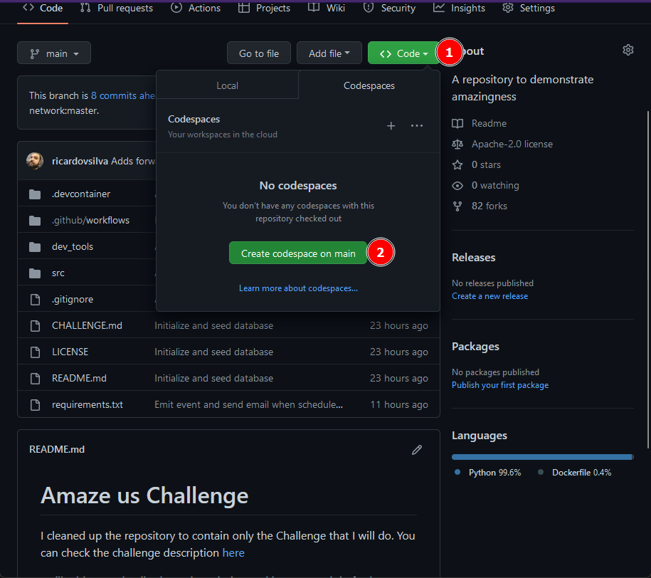
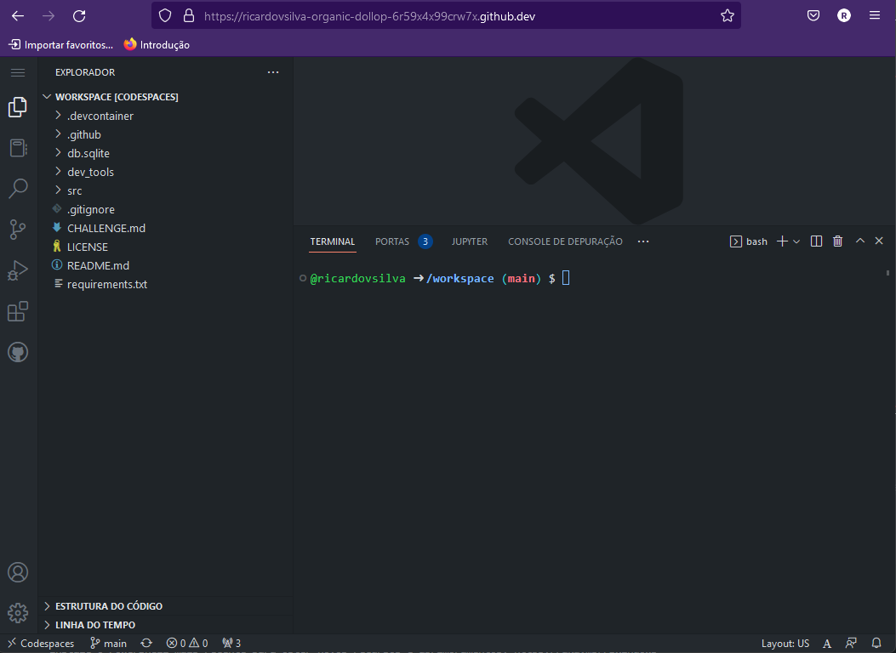
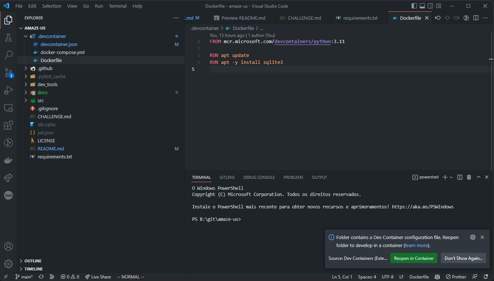

# Amaze us Challenge

I cleaned up the repository to contain only the Challenge that I did. You can check the challenge
description [here](CHALLENGE.md)  

Aside from Python Challenge, with a framework I had never used, I challenged myself to develop this entire project
on my windows computer using only [Visual Studio Code](https://code.visualstudio.com/) and [Dev Containers](https://code.visualstudio.com/docs/devcontainers/containers).

## Solution  
This backend solution provides an API to create and delete **Schedules** and manage **Drivers** and **Buses**. The entire solution
was developed using [FastAPI](https://fastapi.tiangolo.com/).

### Features implemented  
- E-mails based on events: every time a schedule is created or deleted, the driver will receive an e-mail with pertinent information. The email is not formatted thinking in the final user as this is not the intent of this test. It is to show the application emitting events and sending e-mails to an SMTP server. You can check the e-mails in MailHog by accessing `http://localhost:8025`;
- Developer tools: I created some tools to help developers. You can check them by running `python -m dev_tools.run --help`. One command example is `python -m dev_tools.run create-manager-jwt`. Those tools are:
    - rotate-jwt-secret: recreate the jwt.json file. It could be used if the secret gets leaked, for example. This command runs after the container start;
    - init-database: creates the database tables and seeds those. If the tables are already created, all the data will be lost, and random data will be recreated;create-manager-jwt - create-manager-jwt: create and print to the terminal a signed Bearer token with manager role;
    - create-employee-jwt -> create and print a signed Bearer token with employee role to the terminal. Employees only have access to `read` operations;
- Authorization: To use any of the endpoints you will need a `jwt` token. Is possible to ignore the Authorization at all by running the application with the env variable `SECURE_API=False`. You can simply run `SECURE_API=False uvicorn src.main:app`. To call the endpoints using the Bearer token you will need to add an `Authorization` header. Also is possible through the documentation UI at `http://localhost:8000`

## Setting up the development environment
There are two ways to run this solution: [GitHub Codespaces](https://github.com/features/codespaces) or locally. All GitHub users have a free quota if you only want to play with this repository.

### On Codespaces
You only need to open this repository on GitHub and click the Codespaces button.

It may take five minutes to build the container, so it is an excellent moment to get a coffee.  
You will know that container is running correctly when you see the terminal loaded:  

#### Limitations of Codespaces  
Unfortunately, I could not make `SQLite Web` run properly on the codespace web, and I did not test it opening the codespace directly on the local VSCode. You will still be able to develop but without using the UI of `SQLite Web`.

### Locally with Dev Container
To run locally, you will need to have the following software:  
- [Docker](https://docs.docker.com/engine/install/) installed and running;
- [Visual Studio Code](https://code.visualstudio.com/);
- [Official Microsoft extension Dev Containers](https://marketplace.visualstudio.com/items?itemName=ms-vscode-remote.remote-containers).

Then you only need to open this project on [Visual [Studio Code](https://code.visualstudio.com/), and it will ask you to run inside a dev container:  

You can also use the command by press ctrl+shift+p, `Dev Containers: Rebuild and Reopen in Container`

As well as in codespaces, it will take a while to build. You only need to build the container one time.

#### What happens in this Dev Container?
Some developer tools will be available to you, and you will have Python pre-installed in the container:  
1. After the startup of the container, all dependencies listed on the `requirements.txt` will be installed;  
1. A file that contains a secret to generating jwt tokens will be created. The file name is `jwt.json`;  
1. A `db.sqlite` file will be created, and the database will be seeded with random 10k buses, 10k drivers, and 1 million schedules.

### Locally with Docker Compose
Is also possible to run directly with docker compose. You only need to navigate to `.devcontainer` folder and run `docker compose build && docker compose up`. After start the containers you will need to enter in the container of the service `app` and then run the `postCreateCommand.sh` manually.

## Running the application
After properly setting up the dev container, open a bash terminal and, at the root of the project, run the command `uvicorn src.main:app`. You will be able to access the complete documentation of the API by accessing `http://localhost:8000` or the address that codespaces give you.

At `http://localhost:8025` you will have access to [Mailhog](https://github.com/mailhog/MailHog). [Mailhog](https://github.com/mailhog/MailHog) acts like a mail trap and provides an SMTP server to which you can send emails and a proper UI to check if the e-mails arrived.
