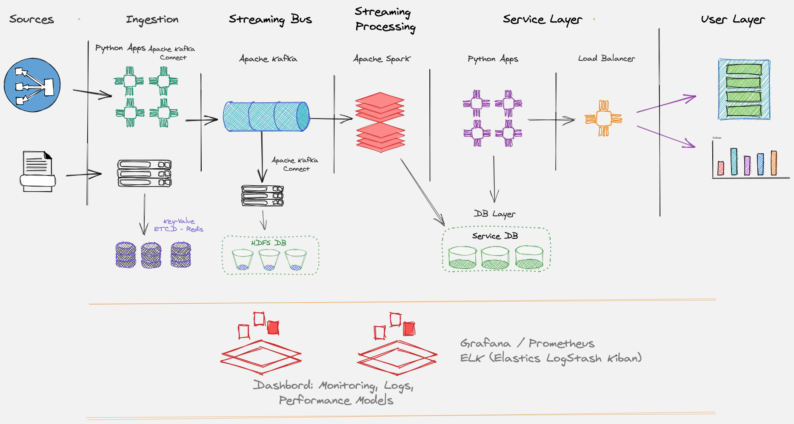
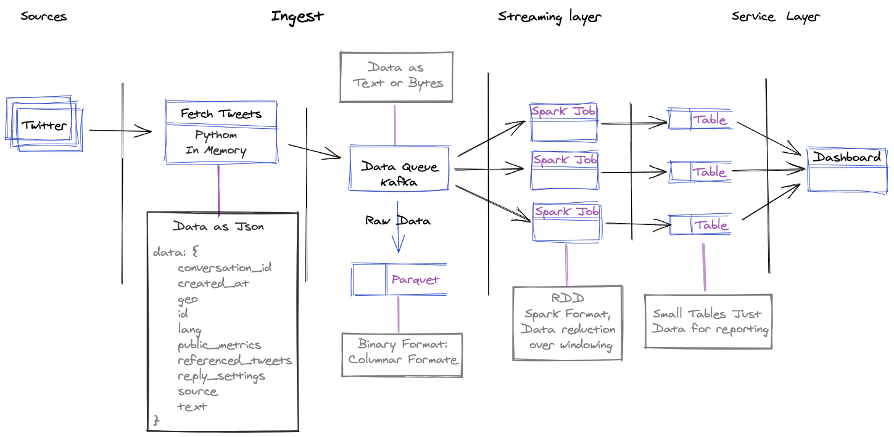

# EvilNet Challenge

**NOTE**: The original scope was Rule the world using the social Networks. Since the short scheduled, not have the proper level of credential of Tweets. I reduce the scope to Design and Next Steps

# EvilNet Architecture:

## Conceptual View:



## Design Rationals:
 1. Focus Frameworks that allows us to horizontal scale,
 1. Divide and Conquer
    * Sources
        * Third Party Components (Social Net)
        * Company Source (logs, Marketing)
    * Ingest
        * Apps focus thats fetch/crawling Data
    * Streaming Bus
    * Streaming Processing
    * Service Layer
        * Apps thats expose apis to retrieve specific data, reports
        * Load Balancers
    * Storage
        * HDFS
        * DB Service
        * Caching
        * Configuration

## Data Flows:



## Components Architecture:
* Ingest:
    * Python Apps, using Key-value store to propagate specifics configurations
    * [Apache Kafka Connect], to read from standards sources.
* Streaming Bus
    * Publish/Sub Pattern [Apache Kafka Bus] Stack
    * [Apache Kafka Connect] to persist Raw Data in [Apache Parquet] to HDFS store
* Streaming Processing
    * [Apache Spark] Job 
* HDFSs:
    * S3 or GCS or Hadoop type
* Service DB:
    * [MySQL] DB for Report storage
    * [Redis] or [ETCD] for Key-Value store
* Monitoring:
    * [Grafana] Dashboards to metrics
    * [ELK] Elastic Logstash Kibana 

## Resource Footprint analysis

* Twitter Data: 
    1. tweets: ~100 bytes (estimated avg)
    1. daily: 130-150 million (estimated)
    1. Size per day: 180MB (estimated)
        1. 7.5M per Hour
        1. 2k Mgs per sec
* Ingest 180MB per day
    * Kafka Cluster Manage this smoothy, although it should monitor the Consumer lags
        * [Kafka Perfomance](https://www.confluent.io/blog/kafka-fastest-messaging-system/) 
* Streaming Processing
    * Need Additional Review on this Subject, but spark is capable to scale horizontal

##  Scalability Strategy

* Kafka Broker
    * Multiple Partition per each Topic
    * Increase the number of nodes in the cluster
* Kafka Connect
    * Number of Task per Instances
    * Number of Tables
    * Instrument a Kafka Connect Cluster
* Spark Streaming
    * Separate thread for each stream in the driver
        * Tune the Memory for Driver
    * Separate divers instances for each stream
    * Spark Cluster Add Worker nodes
        * Tune Memory For executor
* MySql DB
    * keep the table small to not impact performance
    * if it is not possible move to distribute tables like
        - Cassandra
* Ingestion Apps
    * Increase the number of Container Running App for Fetch data.

# Next Steps:
* Finish E2E Concept:
    * add MySQL Service
    * develop Service Apps Layer
    * Design API for serving data
    * develop showcase for the API thats serve the data
    * develop a spark streaming job the count number of tweets per City
        * over windows time
    * Create python package thats abstract common function
    * Add Unit Test for code
* Add Missing Service at docker-compose
    * Apache Kafka Connect
    * Grafana
    * ELK
    * LoadBalancer
* Add Unit Test for python apps
* Create Spark Streaming Jobs to Aggregate data
* Configure Kafka Connect to persist Data (kafka-parquet)
* Improve the Scalability Plan base on Current Numbers
* TODO

## Requirements

* Docker: [how to install](https://docs.docker.com/get-docker/)
  * Docker-Compose: [how to install](https://docs.docker.com/compose/install/)
* Docker Hub Images:
  * [mysql](https://hub.docker.com/_/mysql)
  * [apache/kafka](https://hub.docker.com/r/confluentinc/cp-kafka)
  * [apache/zookeeper](https://hub.docker.com/r/confluentinc/cp-zookeeper)
  * [apache/kafka-connect](https://hub.docker.com/r/confluentinc/cp-kafka-connect)
* Python 3.*

## Environment

*Folder: evil_infrastructure*

* It is based on docker images orchestrated by docker-compose, after the env is generated, it is trigger and twitter ingest, that publish into kafka. At Notebook to show case how to connect to stream

## Links

* EvilStream Notebook:
  * http://127.0.0.1:8001

NOTE: **Neigther password nor token** is require to access to [EvilStream Notebook]


# How to Use?

## Generate the requirements file 
```bash
pipenv lock -r > evil-infrastructure/ingest/requirements.txt
```

## Build the Docker images (Notebook, Sparks)

```bash
docker-compose -f evil_infrastructure/docker-composer.yml build
```

## Start Services

```bash
docker-compose -f evil_infrastructure/docker-composer.yml up
```

### Connect to Evil Notebook

* Got [EvilStream Notebook] and open EvilNet Streamming Example.ipynb


## Links

* EvilStream Notebook:
  * http://127.0.0.1:8001

NOTE: **Neigther password nor token** is require to access to [EvilStream Notebook]


[Apache Kafka Connect]: https://docs.confluent.io/platform/current/connect/index.html
[Apache Kafka Bus]: https://docs.confluent.io/platform/current/kafka/introduction.html
[Apache Spark]: https://spark.apache.org/
[Grafana]: https://grafana.com/
[ELK]: https://www.elastic.co/es/what-is/elk-stack
[Apache Parquet]: https://parquet.apache.org/
[Redis]:https://redis.io/
[ETCD]:https://etcd.io/
[MySQL]:https://www.mysql.com/
[EvilStream Notebook]: http://127.0.0.1:8001