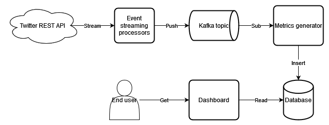

**Author**: Mathieu Pelletier 2021

**Email**: mathieu.pelletier@breakpoints.ca

# Usage

- Run command `docker-compose up` in challenge-3 folder
- Open a browser to http://localhost:8080
- The graphs are refreshed every minutes
  -- Data should appear after 5 minutes

# Known issues

- The retweet count seems to be always at 0. Maybe I didn't run the process for enough time. Based on Twitter documentation (https://developer.twitter.com/en/docs/twitter-api/v1/data-dictionary/object-model/entities#retweets-quotes), the tweet event should have a retweeted_status flag at true in case of retweet. Unfortunately, I didn't received events with that flag on.

# Solution design

## Architecture

Main components:
- Event streaming
- Metrics generator
- Kafka
- Database (could be NoSQL)
- Dashboard (web server)

The first component is the event streaming processor. It connects to Twitter REST API to retrieve tweets based on location filters. It keeps only basic fields needed from the REST API response. The response is then push on a Kafka topic for further processing down the line.

The seconds step is to calculate the metrics. We use Spark streaming to do that. Using a time window (5 minutes), the raw events from Kafka are aggregated into the target metric. After that, they are persisted in a database (MySQL).

The last component is the dashboard. It contains two part, the backend code (Flask) retrieve the data from the database and returns it to the frontend. The frontend in is charge of displaying the reports (Chartjs). Every minutes, the charts are updated with new data.

# Reprocessing

It's possible to reprocess last hour data using Kafka offset. Data is persisted for a certain amount of time (configurable) in Kafka topics. You can use the Spark option startingOffsetsByTimestamp, to retrieve data from the last hour and reprocess it (https://spark.apache.org/docs/latest/structured-streaming-kafka-integration.html). Unfortunately, it will probably create duplicate records in the database. My current code doesn't support this scenario but it could be easily fix by changing the query (UPSERT). Certain database backend don't have this issue (ex: hbase, cassandra). You simply overwrite the record with a new value (version) using a row key.   

# Scalability plan

- Add more event streaming processors to retrieve data for different regions/countries. The tweet stream processor used location (bounding box) filters. We could scale this component by region. If one processor is unable to process data within a reasonable amount of time, we could split up the load by using smaller bounding box.
- Kafka is a proven solution to process real-time streaming events. This component can scale well by adding new brokers.
  - We could create different topic per region / countries to improve the processing time and scalability
- The metrics generator use Spark to aggregate raw data and create metrics. Spark can be scale easily based on resource consumed.
- Depending on the needed retention, we could use a tradional RDBMS. If the database cannot handle the volume of data, the database could be replaced by a time-series database or NoSQL database. 
  - Again here, to improve storage and processing we could create partitions based on regions / countries
- Frontend can be scale by adding a proxy layer and add more web servers behind it. The proxy route the user request to an available web server.
  - The web backend component is stateless so it can be scale easely. We can add more web servers to serve user requests.

