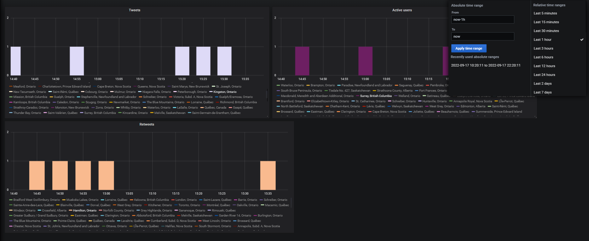
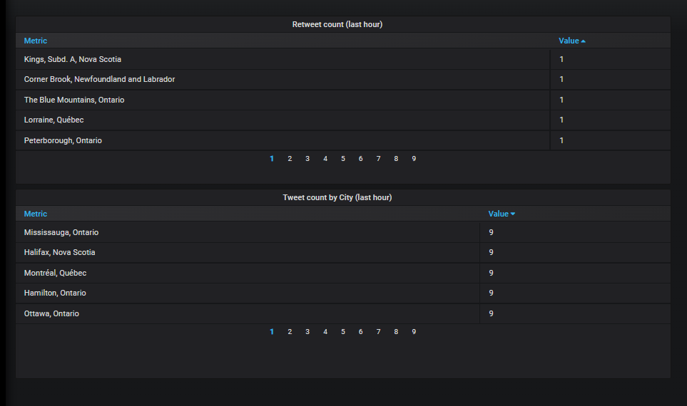
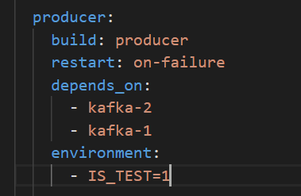

# Challenge 3 - EvilNet rules the world

***1 - Architecture***

In this architecture a container app will stream tweets using the Twitter v2 api, and will produce to a replicated kafka topic which has a time retention period to be determined.

The kafka cluster has two brokers, and two zookeepers, it's possible to use both brokers for producing to kafka and consuming from kafka (using spark). In this case the solution would be able to handle failovers, it's also possible to use each broker for a task, and we need to test using a heavy stream if any performance enhancement can come from this.

 Batch streaming will be done using 1 spark master node, it can be extensible by adding workers.

 The batch streaming is orchestrated by a "structured streaming" python app, which will stream data from kafka aggregate it and save it to Cassandra DB.

Grafana was chosen as the visualizer for its aesthetics, and ease of use.

***2 - Code***

  A. Docker-compose : a docker-compose file has been created, which upon start up will spin up the containers and run all the services.

  B. Producer: An encapsulated module was written for the purpose of streaming from twitter and producing to kafka, this can be upgraded by adding a generic filter or r                rules.
               As a future task, this module will be improved to stream and produce asynchronously by using asyncio and aiokafka.

  C. Stream processor: A python driver script has been written to run against the master spark, it will perform structured streaming from Kafka to Cassandra.
                       The aggregation count  by city,time has been implement in this script. The first time the job launches it will start from the earliest offset of the topic, if a failure occurs, the container will relaunch with and consume from the latest offset.

  D. Tester: A tester container has been added, please refer to testing section for details.
  
  
 ***3 - Startup script***

 Please use ./start-all.sh, it contains the "docker-compose up". 
 
 The following was added "sed -i -e 's/\r$//' ./scripts/cassandra_init.sh".

This deals with replacing the encoding of CRLF file with LF.

If git is configured to transform the file from LF to CRLF, the mentioned line will fix it.
 
 
 ***4 - Visualization, queries, and restrictions***

Please use the following http://localhost:3000/ to enter the grafana visualizer , use 'admin' as username and password.

In the dashboard section you will find counts and trends which are shown below.

Please wait for the services to start and tables to be populated, the casssandra db was not configured for data persistency. 

The below queries were used for trends, however a Where condition is missing on the city which will allow to return data of a single or multiple cities, the reason is  due to a bug in grafana, it was not able to query the unique cities from cassandra and return as a list of variables.

Select city,CAST(count(count) as double),date from evilnet.tweets  where  date >= $__timeFrom and date <= $__timeTo group by city,date  ALLOW FILTERING;

Select city,CAST(count(count) as double),date from evilnet.retweets  where  date >= $__timeFrom and date <= $__timeTo group by city,date ALLOW FILTERING;

Select city,CAST(count(count) as double),date from evilnet.uniqueuserswhere  date >= $__timeFrom and date <= $__timeTo group by city,date  ALLOW FILTERING;
(unique users for time window were counted in spark streaming)

It's true that the queries are returning data of all cities, but cassandra can offord such queries continiously as the schema design was created to perform aggregation by city,date.

The maximum number of returned values from this query for an hour interval would be at worse 
1130 (number of all cities in canada) * 12 ( number of 5 mins points) = 13,560
Which can be handeled by grafana without compromising the refresh rate.

The approach is not perfect, but on the plus side the visualiser will display for the user the queried cities below the table without choosing from a list of variables.

The $__timeFrom and date <= $__timeTo can be controlled from the time bar and are passed to the query.

The idea of using cassandra for this challenge is to explore it and learn it, as it provides high performance and scalability. The query issue can be solved by switching to mongodb or pgsql,mysql.

The below queries were used for counts by cities over last hour, another imperfection was made in the query, as it was not possible to ORDER BY count, and LIMIT 5.

Instead the aggregation over cities was returned, the maximum number of values that could be returned is 1130.

Cassandra schema is a query based schema which will ensure performance, and data integrity on distributed machines, the schema was created to aggregate by city,date. And its not possible to sort without specifing a WHERE is equal operation. A solution is to add a partition key for all records, for exp key=1, and when sorting we can user the where condition key=1. 

The sorting is taking place in grafana instead.

Select city,CAST(count(count) as double),date as aggcount from evilnet.retweets  where  date >= (toTimestamp(now()) - 1h) group by city  ALLOW FILTERING;

Select city,CAST(count(count) as double),date as aggcount from evilnet.tweets  where  date >= (toTimestamp(now()) - 1h) group by city  ALLOW FILTERING;

 ***5 - Tests***

  A. Fidelity tests: It's possible to miss messages coming from twitter due to routing or networking issues.

 Twitter infra is mostly on GCP and it's preferable to deploy next to an edge there, or in a GCP datacenter.

 If Evilnet are rooting for top accuracy, It's possible to do fidelity testing by streaming twitter data from multiple cloud locations.

 The process of streaming will start at the same time on similar machines but in different locations, it will endure for a large enough window, data can be collected for comparison.

 Finally, it’s possible to collect the data and compare it, the comparison will allow us to infer which host has least missing records.

 B. Automated test: A test container has been added for the purpose of data validation. The goal of the test is to simulate the whole data pipline. In order for the
 
 pipline to go into test mode we need to change the IS_TEST=0 into IS_TEST=1 in the docker compose file as shown below.
 
 
    

  ***6 - resource footprint analysis***
  
         Kafka queus and tables will have retention period, this will limit storage usage.

         If the components are owned they can be monitored using prometheus and grafana.
         
         We could run the apps for a large enough period of time, ideally the peak usage should be 80 % of the total resource limit.
          
         Points and details will be added soon. 
          
  ***7- Scalability plan***
  
        Code scalibality:
        
        Infra scalibality
        
        Will be added soon. 
