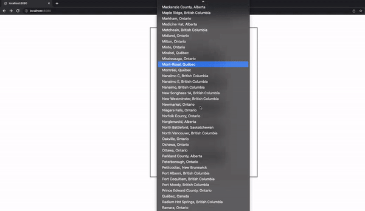
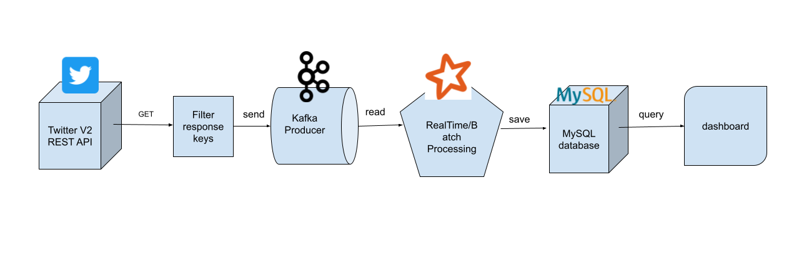

# EvilNet Data Pipeline Documentation

## User Manual
To run the application from a clean start, move to `challenge-3` directory, and run the following:

```bash
# shutdown the containers
$ docker-compose down
# remove volumes if you dont't want to see old data
$ docker volume rm $(docker volume ls -q)
# run the docker-compose
$ docker-compose up -d
```

Access the dashboard using the link: http://localhost:8080

## Demo
As the data comes in, the active twitter cities are added to the list of cities. By selecting one, you can click on the corresponding button and view the metrics.



## Checklist
- explore the twitter API using the links provided in the [README.md](.\READ-ME.md).
- 
- [X] stream tweets with the appropriate query into Kafka producer
    - [X] stream only Canadian tweets (set as rule)
    - [x] ask for `place` info in query and include city name in Kafka object.
- [X] since we are dealing with data stream, we publish data to Kafka for later processing
- [X] data is fetched from Kafka to Spark and the required metrics are extracted using SQL and pandas (batch processing)
- [X] create a user interface dashboard
- [X] dockerize each step
- [X] write a docker-compose
- [ ] write unit test
- [ ] explore some ideas for scaling the application

## Solution
### Architecture
- Stream filtered data from Twitter API
- Collect the necessary keys in the responses
- Publish the data through `Kafka`
- Receive data from `Kafka` and batch process using `Spark`
- Store the processed data in `MySQL` database
- Connect a dashboard to the database using `flask`, `chart.js` and `pymysql`.



### Scalability
Each of the components used along the data pipeline are highly scalable and can be used to serve multiple data sources, more processings and more users.

- For countries and cities around the world, the same containers could be scaled horizontally to accomodate all producer/consumer pairs.

- Subsequently, different countries can potentially have different topics in Kafka and different SQL tables.

- To do so, we can use consumer groups, to further reduce the weight on one single Kafka Consumer (Spark here), and further optimize high data throughputs.

### Testing

## Notes
### Timing Values
- Spark:
  - calls a batch every 1 minute
  - categorizes data into windows of 15 minutes
- SQL: 
  - Asks for the data in the last hour
- dashboard:
  - updates the endpoint every 1 minute

### Challenge of Twitter V2 API
Twitter API V2 does not have location-based operators yet as mentioned [here](https://developer.twitter.com/en/docs/twitter-api/tweets/filtered-stream/migrate/standard-to-twitter-api-v2). The alternative to this problem is to use the V1.1 API with an elevated access.
In order to use this API for locations, we need to use the "https://stream.twitter.com/1.1/statuses/filter.json" endpoint. However, the access to this endpoint has been deprecated for new developer accounts (such as mine) as of April 2022 [[link](https://stackoverflow.com/questions/72130397/bad-twitter-streaming-request-403/72134055)].
To resolve thos issue, you need to get the `elevated` developer permissions in order to use the [Filtered Stream](https://developer.twitter.com/en/docs/twitter-api/tweets/filtered-stream/quick-start) endpoint.


# Code References
- [Twitter API dev](https://github.com/twitterdev/Twitter-API-v2-sample-code/blob/main/Filtered-Stream/filtered_stream.py)
- [Kafka Python](https://towardsdatascience.com/an-extensive-guide-to-collecting-tweets-from-twitter-api-v2-for-academic-research-using-python-3-518fcb71df2a)
- [Docker Compose](https://docs.docker.com/compose/gettingstarted/)
- [Kafka Docker](https://hub.docker.com/r/bitnami/kafka/): This docker is faster and lighter than the Confluent one!
- [Connecting Spark to Kafka](https://spark.apache.org/docs/latest/structured-streaming-kafka-integration.html)
- [MySQL Docket](https://hub.docker.com/_/mysql)
- [PySpark Java Exception](https://sparkbyexamples.com/pyspark/pyspark-exception-java-gateway-process-exited-before-sending-the-driver-its-port-number/)
- [Kafka-Spark NoClassDefFoundError](https://stackoverflow.com/questions/61103269/facing-noclassdeffounderror-error-at-kafka-spark-structured-streaming-integratio)
- [Dashboard graphs](https://blog.ruanbekker.com/blog/2017/12/14/graphing-pretty-charts-with-python-flask-and-chartjs/)