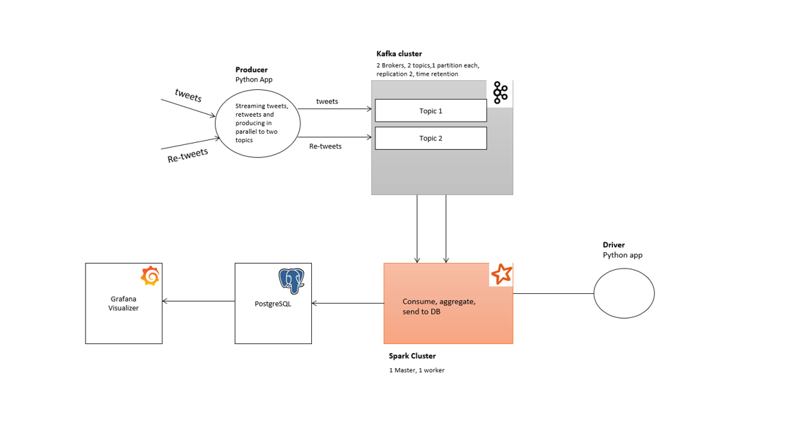

# Challenge 3 - EvilNet rules the world
1 - Architecture

In this architecture a producer app will stream tweets/retweets in parrallel using two authentication tokens, and produce the stream to two kafka topics.

The topics have been replicated so that the app can handle kafka failovers.

Spark will consume data from these two topics, aggregate it, and send it to postgress sql.

The idea behind having two parallel streams, is that twitter will do the filtering between tweets/retweets, this will reduce computational operations on the producer and consumer. 

After aggregating the data on a certain date it's possible to add the numbers of tweets and retweets instead of filtering on the whole data.

2 - scalability plan
 
3 - code

4 - Start up script
    
    Please use start-all.sh
    
5 - automated tests 

    to do: fidelity test 
           unit tests
           Full test
           
6 - resource footprint analysis
    
    To do