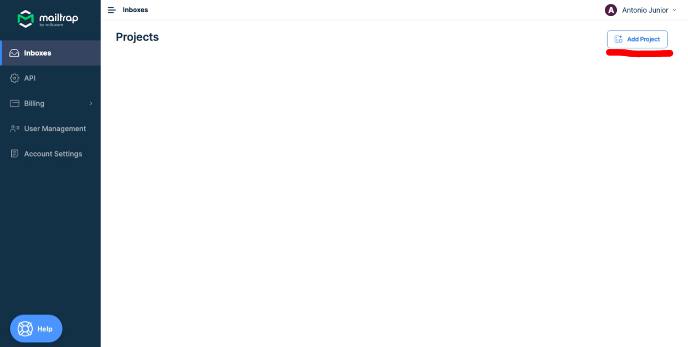
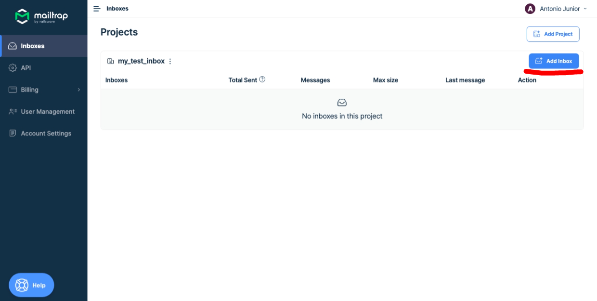
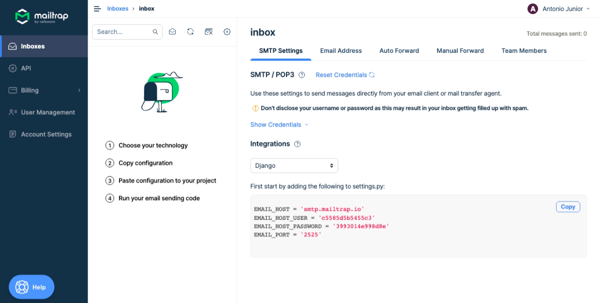
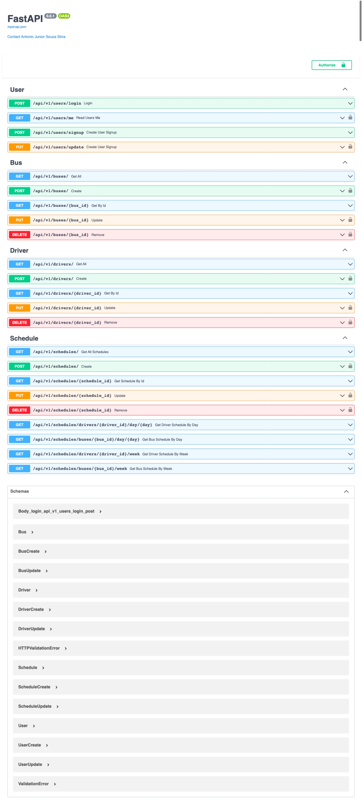

# Bus Scheduler API

### What is included on this project?

- 📦 A [setup.py](setup.py) file to provide installation for the project. It uses setuptools.
- 🤖 A [Makefile](Makefile) with the most useful commands to install, test, lint, format and start the application on docker container or standalone
- 🐋 A [Dockerfile](Dockerfile) and [Docker Compose](docker-compose.yml) to build a container image for your project and run it.  
- You can start your container using one of the following commands below:
```bash
   docker-compose up
```
OR
```bash
   make container
```
- 🧪 Testing structure using [pytest](https://docs.pytest.org/en/latest/)
- ✅ Code linting using [flake8](https://flake8.pycqa.org/en/latest/)
- 📊 Code coverage reports using [codecov](https://about.codecov.io/sign-up/)
---

# Bus Schedule API

## How to use it?

From source

```bash
git clone https://github.com/Antonio-Jr/amaze-us.git
cd intermediate/challenge-1/bus_scheduler
make install
```

## Executing

```bash
bus_schedule run --port 8001 [--reload [--no-reload] ] [--log-level=debug]
    [--host=127.0.0.1] [--seed-db [--no-seed-db] ] 
```

or

```bash
make start
```

If you prefer, you can also run this in a virtual env, just run the commands:
```bash
make virtualenv
source .venv/bin/activate
```

After that, run **bus_schedule run** or **make start** to start the application

# IMPORTANT!

When the application is started in the development environment, a sqlite database is created with some seeded data,
namely:
- 3 drivers
- 3 buses
- 3 Schedules
- 2 Users, one admin and the other not.


- **For some api calls you must authenticate**.

To log in to the API, the following data can be used:

- Admin User:
  - **username**: admin@admin.com
  - **password**: 123456

- Non-admin user:
  - **username**: user@user.com
  - **password**: 123456

## Sending Emails
For some functionality, this application sends an email. In this case, Mailtrap is being used
[Mailtrap](https://mailtrap.io/) to simulate sending emails.
It is necessary to create an account on the platform to carry out the tests, as this is only available in the account
owner's fake inbox.
To [create a mailtrap account](https://mailtrap.io/register/signup?ref=header), simply register, using your Github, Google or Office 365 account.

When entering the administration area, if there is no project created, click on new project and give it a name, as shown in the image below:



Once the project is created, just click on add inbox to create a new one and give it a name, as can be seen below:



After creating the inbox, click on it to collect configuration information for the simulation of sending emails.
On this page, for readability, select Django in the Integrations box.



Copy the values of **EMAIL_HOST_USER** and **EMAIL_HOST_PASSWORD**, and replace the *"CHANGE ME"* values in [default.toml](src/default.toml) file, which is inside the
[src](src) folder of the project.

```toml
[default.email]
EMAIL_HOST = "smtp.mailtrap.io"
EMAIL_PORT = "2525"
EMAIL_USERNAME = "CHANGE ME"
EMAIL_PASSWORD = "CHANGE ME"
EMAIL_FROM = "team@busscheduler.com"

[testing.email]
EMAIL_HOST = "smtp.mailtrap.io"
EMAIL_PORT = "2525"
EMAIL_USERNAME = "CHANGE ME"
EMAIL_PASSWORD = "CHANGE ME"
EMAIL_FROM = "testing@busscheduler.com"
```

Once this is done, the application is ready to send emails.

## CLI

```bash
❯ bus_schedule --help
Usage: bus_schedule [OPTIONS] COMMAND [ARGS]...

Options:
  --install-completion     Install completion for the specified shell.
  --show-completion        Show completion for the specified shell, to copy it or customize the installation.
  --help                   Show this message and exit.

Commands:
  run          Run the API server.
  seed-db      Create a database if not exists and seed it
```

```bash
bus_schedule seed-db [--no-seed]
```

## API

Run with `bus_schedule run` and access http://0.0.0.0:8001



## Testing

``` bash
❯make test
========================================================================== test session starts ==========================================================================
platform darwin -- Python 3.9.9, pytest-7.1.2, pluggy-1.0.0
rootdir: /Users/antonio-jr/Projetos/bus_scheduler, configfile: pytest.ini
plugins: anyio-3.6.1, ordering-0.6, cov-3.0.0
collected 107 items

tests/test_cli.py ..                                                                                                                                              [  1%]
tests/integration/test_bus_endpoint.py ...............                                                                                                            [ 15%]
tests/integration/test_driver_endpoint.py ............                                                                                                            [ 27%]
tests/integration/test_schedule_endpoint.py .................                                                                                                     [ 42%]
tests/integration/test_user_endpoint.py ...............                                                                                                           [ 57%]
tests/unit/test_bus_service.py .............                                                                                                                      [ 69%]
tests/unit/test_driver_service.py ........                                                                                                                        [ 76%]
tests/unit/test_schedule_service.py ...................                                                                                                           [ 94%]
tests/unit/test_user_service.py ......                                                                                                                            [100%]

=========================================================================== warnings summary ============================================================================
tests/integration/test_schedule_endpoint.py: 24 warnings
tests/integration/test_user_endpoint.py: 2 warnings
  /opt/homebrew/lib/python3.9/site-packages/fastapi_mail/msg.py:102: DeprecationWarning: Use ``template_body`` instead of ``body`` to pass data into Jinja2 template
    warnings.warn(

-- Docs: https://docs.pytest.org/en/stable/how-to/capture-warnings.html

---------- coverage: platform darwin, python 3.9.9-final-0 -----------
Name                                    Stmts   Miss  Cover
-----------------------------------------------------------
src/cli.py                                  8      0   100%
src/config.py                               4      0   100%
src/context/user_context.py                22      4    82%
src/core/auth.py                           27      0   100%
src/core/email.py                          38      0   100%
src/core/security.py                        6      0   100%
src/database/db.py                         44      0   100%
src/database/db_error_handler.py           35      2    94%
src/database/seed/bus_seed.py               1      0   100%
src/database/seed/driver_seed.py            1      0   100%
src/database/seed/schedule_seed.py          2      0   100%
src/database/seed/user_seed.py              3      0   100%
src/endpoints/auth_endpoint.py             36      0   100%
src/endpoints/bus_endpoint.py              42      0   100%
src/endpoints/driver_endpoint.py           41      0   100%
src/endpoints/schedule_endpoint.py         74      0   100%
src/exceptions/app_exception.py            19      0   100%
src/exceptions/auth_exception.py            8      0   100%
src/exceptions/db_exception.py             15      0   100%
src/main.py                                22      0   100%
src/models/bus_model.py                    15      0   100%
src/models/driver_model.py                 12      0   100%
src/models/schedule_model.py               28      0   100%
src/models/user_model.py                   10      0   100%
src/routes/api_routes.py                    4      0   100%
src/routes/v1_routes/v1_api_routes.py       7      0   100%
src/schemas/bus_schema.py                  21      0   100%
src/schemas/driver_schema.py               20      0   100%
src/schemas/schedule_schema.py             25      0   100%
src/schemas/token_schema.py                 4      0   100%
src/schemas/user_schema.py                 24      0   100%
src/services/base_service.py               54      2    96%
src/services/bus_service.py                 6      0   100%
src/services/driver_service.py              6      0   100%
src/services/schedule_service.py           53      0   100%
src/services/user_service.py               26      0   100%
src/templates/email_templates.py            9      0   100%
-----------------------------------------------------------
TOTAL                                     772      8    99%

============================================================== 107 passed, 26 warnings in 90.60s (0:01:30) ==============================================================
Wrote XML report to coverage.xml

```

## Linting and Formatting

```bash
make lint  # checks for linting errors
make fmt   # formats the code
```

## Configuration

This project uses [Dynaconf](https://dynaconf.com) to manage configuration.

```py
from src.config import settings
```

## Acessing variables

```py
settings.get("SECRET_KEY", default="sdnfjbnfsdf")
settings["SECRET_KEY"]
settings.SECRET_KEY
settings.db.uri
settings["db"]["uri"]
settings["db.uri"]
settings.DB__uri
```

## Defining variables

### On files

[settings.toml](settings.toml)

```toml
[development]
dynaconf_merge = true

[development.db]
echo = true
```

> `dynaconf_merge` is a boolean that tells if the settings should be merged with the default settings defined in
bus_schedule/src/default.toml.

### Switching environments

```bash
ENV=production bus_schedule run --port 8001
```

