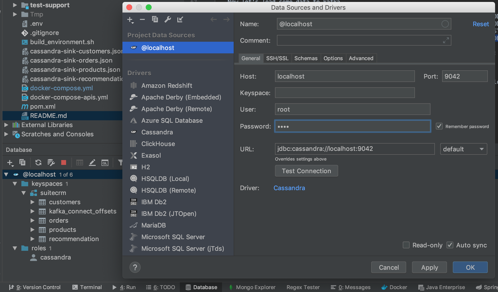

SuiteCrm - B-Yond microservice Challenge
===================
This is basic to demonstrate how to break a complex monolithic CRM app into a horizontally scalable microservice-oriented application.

It consist of 4 modules:
 - [Csv ingester](csv-ingester) : simulate a CDC/ETL to ingest data to Apache Kafka
 - [Kafka processing](kafka-processing) : Kafka streams application that process/transform incoming data before storing them to Apache Cassandra database
 - [Customers rest Api](customers-api) : Rest API for managing customers
 - [Orders rest Api](orders-api) : Rest API for customers's orders
 
Setup environment
-----------------------
Requirements:
- Docker and docker-compose
- Maven 3
- Java 1.8

##### Install
Open your terminal and go to project basepath and run these steps:

1. Build environment: `./build_environment.sh`

2. Maven intall project: `mvn clean install`

Run the Apps whith Docker
-----------------------
Open your terminal and go to project basepath and run these steps:

1) #### Start Kafka and Cassandra
   
   ```
   docker-compose -f docker-environment/docker-compose.yml up -d --force-recreate
   ``` 
   This will start Kafka an Cassandra
   - Kafka UI: http://localhost:3030
   - Cassandra url: localhost:9042

2) #### Create topics
   
   ```
   docker exec -it kafka /bin/bash -c \
     "kafka-topics --create --zookeeper localhost:2181 --replication-factor 1 --partitions 1 --topic customers-stream --config cleanup.policy=delete --if-not-exists \
     && kafka-topics --create --zookeeper localhost:2181 --replication-factor 1 --partitions 1 --topic products-stream --config cleanup.policy=delete --if-not-exists \
     && kafka-topics --create --zookeeper localhost:2181 --replication-factor 1 --partitions 1 --topic products-relations-stream --config cleanup.policy=delete --if-not-exists \
     && kafka-topics --create --zookeeper localhost:2181 --replication-factor 1 --partitions 1 --topic orders-stream --config cleanup.policy=delete --if-not-exists \
     && kafka-topics --create --zookeeper localhost:2181 --replication-factor 1 --partitions 1 --topic product-events --config cleanup.policy=delete --if-not-exists \
     && kafka-topics --create --zookeeper localhost:2181 --replication-factor 1 --partitions 1 --topic recommendation --config cleanup.policy=delete --if-not-exists \
     && kafka-topics --create --zookeeper localhost:2181 --replication-factor 1 --partitions 1 --topic table-product --config cleanup.policy=compact --if-not-exists "
   ``` 
   Check if the topics are created : http://localhost:3030/kafka-topics-ui/#/

3) #### Create kafka connect Cassandra Sink instances
   
   ```
   curl -X POST -H "Content-Type: application/json" --data @cassandra-sink-customers.json http://localhost:8083/connectors
   curl -X POST -H "Content-Type: application/json" --data @cassandra-sink-orders.json http://localhost:8083/connectors
   curl -X POST -H "Content-Type: application/json" --data @cassandra-sink-products.json http://localhost:8083/connectors
   curl -X POST -H "Content-Type: application/json" --data @cassandra-sink-recommendations.json http://localhost:8083/connectors
   ``` 
   Check if sink connect instance are created : http://localhost:3030/kafka-connect-ui/#/cluster/fast-data-dev
   
4) #### Run csv-ingester and kafka-processing apps 
   
   ```
   docker-compose up --force-recreate
   ``` 
   Now let's load some data to kafka
   ```
   docker exec -it ingester /bin/bash -c "cp -v -R /datasets/_ingester_samples/PRODUCTS/* /datasets/PRODUCTS/"
   docker exec -it ingester /bin/bash -c "cp -v -R /datasets/_ingester_samples/PRODUCTS_RELATIONS/* /datasets/PRODUCTS_RELATIONS/"
   docker exec -it ingester /bin/bash -c "cp -v -R /datasets/_ingester_samples/CUSTOMERS/* /datasets/CUSTOMERS/"
   docker exec -it ingester /bin/bash -c "cp -v -R /datasets/_ingester_samples/ORDERS/* /datasets/ORDERS/"
   ``` 
   Connect to Cassandra and check if topics's are sinked, you should see 4 tables:
    * customers
    * products
    * orders
    * recommendation : this table contain products suggestions to a customers (calculated by the kafka-processing app when orders's product have complementary relationship with others products)

5) #### Instructions to connect to Cassandra and view tables 
   
   Cassandra is accessible on localhost:9042 (root/root).
   
   You can view cassandra tables by connecting to it using these methods:
   
   - **Configure an Intellij database connection**
    
       
   
   - **Using Datastax DevCenter** 
  
       Download the Datastax OpsCenter [here](https://academy.datastax.com/quick-downloads)
    
    
6) #### Run Rest APIs 
   
   ```
   docker-compose -f docker-compose-apis.yml  up --force-recreate
   ``` 
   
   This will start:
     * customers-api: http://localhost:8180/api/swagger-ui.html
        ```
        curl -X GET --header 'Accept: application/json' 'http://localhost:8180/api/customers'
        curl -X GET --header 'Accept: application/json' 'http://localhost:8180/api/customers/1'
        curl -X GET --header 'Accept: application/json' 'http://localhost:8180/api/customers/1/recommendations'
        ```
     * orders-api: http://localhost:8280/api/swagger-ui.html
        ```
        curl -X GET --header 'Accept: application/json' 'http://localhost:8280/api/orders'
        ```

Stop and Clean all
-----------------------
Run this on your terminal from the project basepath:
```
docker-compose -f docker-compose-apis.yml  down
docker-compose down
docker-compose -f docker-environment/docker-compose.yml down
``` 