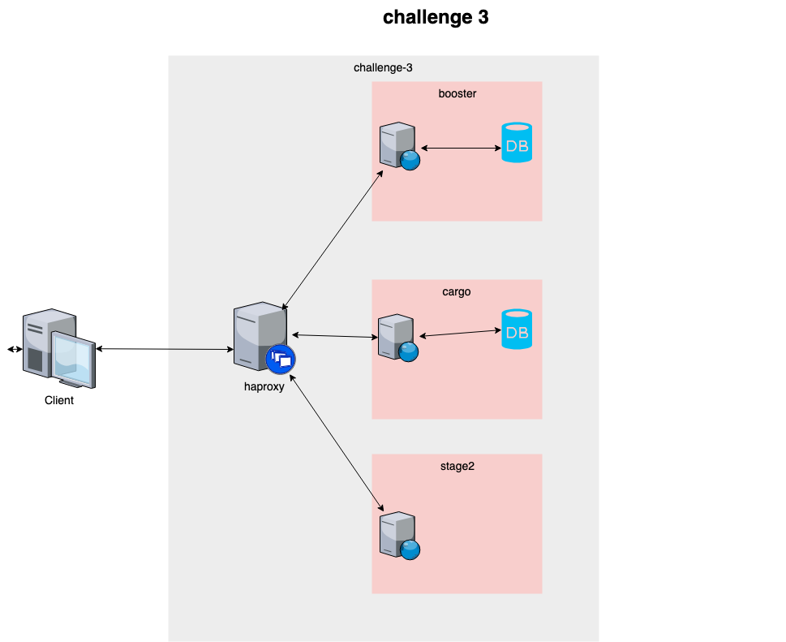

# Challenge 3

> The orchestrator used in this project is `docker-compose` in first step.

## Requirements

- [ ] make
- [ ] docker
- [ ] docker-compose

## How to start

```bash
make help
make up-dev
#TODO find a better way vi /etc/hosts
#127.0.0.1  cargo.localhost booster.localhost
#open your browser on cargo.localhost or booster.localhost
```


## Architecture



## Issues (TODO order by priority)

- [ ] Discuss about monorepo or multirepo. Split the projects in four repositories booster, cargo, stage2 and the orchestrator. 
- [ ] Add `.gitignore` in each project to avoid push unnecessary files.
- [ ] Add `.editorconfig` in each project to avoid hard merge.
- [ ] Add the **right** `tool` in each projet.
- [ ] Add `Dockerfile` to create a image.
    - [ ] Add labels http://label-schema.org/rc1/
- [ ] Add a `docker-compose.yml` in each project and in the global project.
- [ ] Add `a automatic build (travis, jenkins, circleci,...)` in each project.
- [ ] Add `a quality tool (coveralls)` in each project.
- [ ] Refactoring to help to test.
    - [ ] Add `unit test`.
    - [ ] Add `integration test`. 
    - [ ] Add `UI test` (casperjs). 
- [ ] Add `documentation` in each project and the orchestractor.
    - [ ] Documentation on code.
    - [ ] How do we build the application?
    - [ ] How do we use the application (https://www.openapis.org/)?
- [ ] Add metrics for each application
- [ ] Add healthcheck for each application
- [ ] Add logs for each application