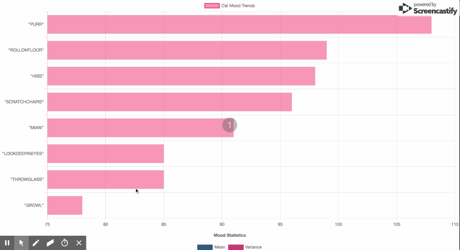

# Challenge 4 - Mysteries of the Cats

Discovery is upon us! The mystery has to be solved! 
After years of research, century of mysticism, we have it.

Here is the truth, we can say with certainty that cats have 7 moods :
```scala
  val GROWL         = "grr"
  val HISS          = "kssss"
  val PURR          = "rrrrr"
  val THROWGLASS    = "cling bling"
  val ROLLONFLOOR   = "fffff"
  val SCRATCHCHAIRS = "gratgrat"
  val LOOKDEEPINEYES = "-o-o-___--"
``` 
Not counting of course, there default "Miaw" mood.
We are on mission. So should you!

First, let's modelize our cats in Scala.
To match reality, those cats should randomly change mood every 27 seconds.
Now, let's simulate a thousand of those during a day.
We will need then to store all of those different cats mood.

Once that's done, we will at last be able to generate some statistics: average, median, variance of the different mood 
over time, anything that can help us pierce the secret.
This of course should scale orthogonally to the number of cats we are simulating, we don't want to end up with angry 
cats, right ?

Make sparks, solve the mystery!


## Solution

I propose a solution where each cat is represented as an akka actor. This encapsulates actor behavior and sets up supervision in the system.
All cat actors are supervised by an OverlordActor, which sets up cats supervision.
The overlord actor reads a property ``clowder.size`` to determine the number of cat actors to create.

Once a cat wakes-up, it starts publishing it's random mood to ```MoodPublishRouterActor``` , which acts as a fan-out router to the
mood publishing actors, ```MoodPublisher```. 
This allows us to de-couple the act of mood swings from mood persistence/publishing.

The ```MoodPublisher``` actor(s) persists moods in ```Apache Kafka``` into topic ```catmoods```

```Spark Structured Streaming``` is used to perform analytics on moods ingested in kafka.

When the app starts, ```SparkStreamingActor``` starts queries to compute top mood trends and mood statistics over a sliding window.

An angular app is included to stream mood trends using a web socket connection between the client and backend.




### Tech Stack

1. Play Framework
2. Scala
4. Akka Actors
5. Apache Kafka
6. Apache Spark
7. Angular
8. Chart.js

### Running the App

- Prerequisites
  - Docker
  - Docker Compose
  - Scala
  - SBT
  - NPM
  - Angular
  
- Commands
  
  ```sbtshell
  cd challenge-4
  docker-compose up -d # starts, Zookeeper, KAFKA, Spark ecosystem(1 Master, 1 Worker)
  cd clowder/ui
  npm install
  cd ..
  sbt run
  ```
  
  ```You can view results at http://localhost:4200/```
  ```If you want to integrate stream into your app, WebSocket address ws://localhost:9000/moodtrends```

#### Things learnt
Spent time learning about Spark Streaming (basically, asked my wife)
  