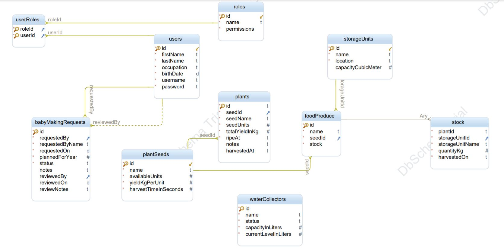
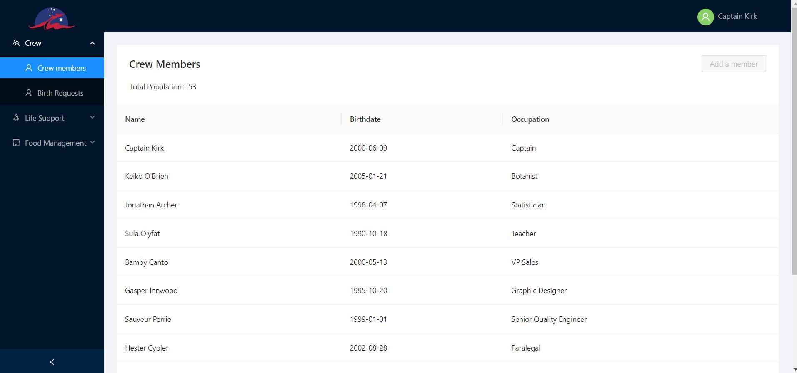
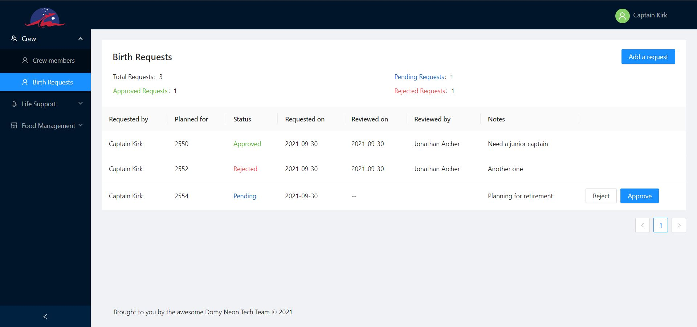
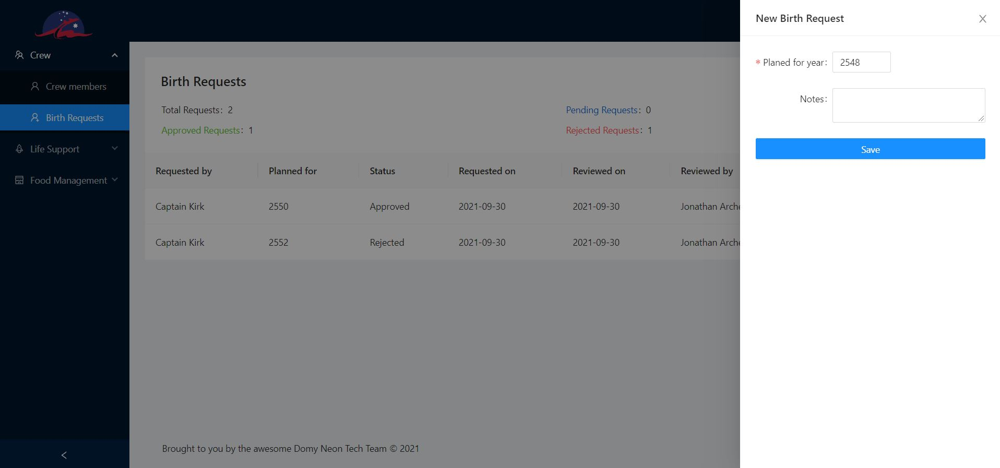

# Introduction

Welcome to Domy Neon V2 a web application for managing the spaceship on the journey to Kepler 186-f. As per the requirements of travelers the app has the following functionalities:

+ Managing water levels and the water collector output
+ Managing food levels and the food production farm output
+ Managing the pioneers population, their current birth authorization and allowing for the projection of those numbers in the future
+ Allowing pioneers to ask for a 'baby making authorization'
+ Allow for the 'Habitat and Survival Management' department to authorize or reject 'baby making authorization' demands

# How to run

## From source

`Nodejs >= 14.17.6` must be installed on the host

1. Navigate to the `api-domy-neon-v2` folder
2. Run `npm install` if it's a first run and then run `npm start`
3. Navigate to the `ui-domy-neon-v2` folder
4. Run `npm install` if it's a first run and then run `npm start`
5. Navigate to http://localhost:3000 to load your application

## Run with Docker

The Docker engine must be installed on the host

1. Run `docker build -t uiux-challenge-v2 .` to build an image
2. Run `docker run --rm -p 5000:5000 uiux-challenge-v2`

# Architecture

The application is composed of a front-end written in `Reactjs` (version `17.0.2`) and a backend service written in `Nodejs` on top of the `expressjs` framework. The backend service also acts as a static files web server hosting the front-end app.

The backend service exposes a RESTfull api that for storing and retrieving the data used by the ui.

# Design choices

## Data Modeling

The following diagram illustrates how the entities are modeled

## Persitence

The data is persisted in memory using the document database `lokijs`, it has a MongoDB like api and an abstraction layer is implemented to allow for easily swapping the datastore.

## Authentication

The authentication on the backend service is handled with a simple local strategy using the `passport` npm package.

The following default accounts are configured:

1. kirk/Abcd123456#
2. keiko/Abcd123456#
3. jarcher/Abcd123456#

## Authorization

A simple role based access control with the following roles:

| Role            | Permissions             | Default Assigned Users |
| --------------- | ----------------------- | ---------------------- |
| ShipAdmin       | CreateUsers, AssignRole | kirk                   |
| SuppliesManager | PlantSeeds, ManageSeeds | keiko                  |
| CrewManager     | ReviewBabyMakingRequest | jarcher                |

# UI Preview

# TODOs

## Frontend

Currently only the crew management module has been implemented, users can view the crew members and the birth requests, a user with the `CrewManager` role can approve or reject the requests.

The next phase would be to:
- Finalize the other modules interfaces (water system and the food management module)
- Add a role and permissions management interface
- Add an overview dashboard that allows to quickly see a summary of relevant information to the users
  - Graphs of food and water levels
  - Population projection
- Optimize the user experience:
  - Add the ability to filter on data tables
- Dynamic ui elements depending on the user interfaces

## Backend

- Server side pagination and filtering
- Persitant storage (MongoDB) for the data layer
- Security requirements:
  - CSP headers configuration
  - Input sanitization
  - TLS encryption
  - Authorization for data filtering with different access levels